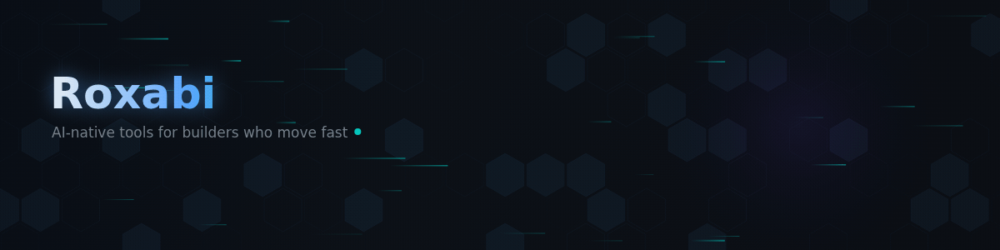

  
  <h1>Roxabi</h1>
  
<strong>Local-first AI tools for builders who ship fast.</strong>

  

    Everything runs on your hardware. No cloud lock-in, no vendor dependencies — 
    just CLI tools, open APIs, and infrastructure you control.
  

---

### 🚀 Flagship

| Project | Description | |
|:--------|:------------|:-|
| **[roxabi-plugins](https://github.com/Roxabi/roxabi-plugins)** | Claude Code plugins — battle-tested skills and agents for dev lifecycle, code review, web intel, video production, and more |  |
| **[roxabi-boilerplate](https://github.com/Roxabi/roxabi-boilerplate)** | SaaS boilerplate — Bun + TurboRepo, TanStack Start, NestJS, auth, multi-tenancy, integrated AI agent team |  |
| **[lyra](https://github.com/Roxabi/lyra)** | Personal AI agent engine — hub-and-spoke architecture, asyncio, multi-channel (Telegram + Discord), runs 24/7 on your hardware |  |
| **[roxabi-production](https://github.com/Roxabi/roxabi-production)** | Custom React video engine — Puppeteer + FFmpeg pipeline, 14 component kits, CLI renderer |  |

### 🔧 CLI Tools

| Project | Description | |
|:--------|:------------|:-|
| **[voiceCLI](https://github.com/Roxabi/voiceCLI)** | Unified TTS/STT — Qwen3-TTS, Chatterbox, Whisper backends, swap without changing your workflow |  |
| **[imageCLI](https://github.com/Roxabi/imageCLI)** | Local image generation — FLUX.2-klein, FLUX.1-dev, SD3.5, no cloud API required |  |
| **[roxabi-vault](https://github.com/Roxabi/roxabi-vault)** | Persistent structured memory — SQLite + FTS5 full-text search, namespace isolation, sync + async APIs |  |

### ⚙️ Infrastructure & Tooling

| Project | Description | |
|:--------|:------------|:-|
| **[lyra-stack](https://github.com/Roxabi/lyra-stack)** | One-command supervisord setup — run the full Lyra infrastructure with `make start` |  |
| **[roxabi-dashboard](https://github.com/Roxabi/roxabi-dashboard)** | Real-time GitHub project dashboard — NestJS + SSE live updates, GitHub OAuth, workspace config |  |
| **[roxabi-claude-config](https://github.com/Roxabi/roxabi-claude-config)** | Terminal environment — WezTerm + tmux + Claude Code integration, repo-based color theming |  |
| **[roxabi-talks](https://github.com/Roxabi/roxabi-talks)** | Tech talk slides — TanStack Start app with section-based navigation, deployed on Vercel |  |
| **[roxabi-docs](https://github.com/Roxabi/roxabi-docs)** | Documentation site — Fumadocs + Next.js |  |

---

### 🛠 Stack

---

  
    Built in 🇫🇷 &nbsp;·&nbsp;
    <a href="https://github.com/Roxabi/roxabi-docs">Docs</a> &nbsp;·&nbsp;
    <a href="https://github.com/Roxabi/roxabi-plugins">Plugins</a> &nbsp;·&nbsp;
    <a href="https://github.com/orgs/Roxabi/projects/11">We build in public — see what's next →</a>
      
    Want to contribute? See <code>CONTRIBUTING.md</code> in each repo — PRs welcome.
  

