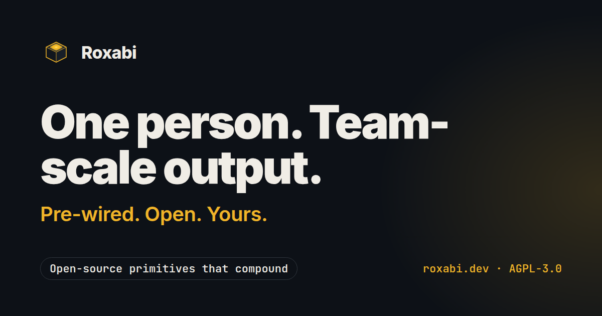

  

  <h1>Roxabi</h1>
  
<strong>One person. Team-scale output.</strong>

  

    A factory for the AI era — agents, workers, tools and skills 
    compounded into one open foundation, yours to fork. 
    Self-hostable · AGPL-3.0 · nothing calls home.
  

  

    <a href="https://roxabi.dev"><strong>roxabi.dev</strong></a> ·
    <a href="https://roxabi.dev/projects/">Projects</a> ·
    <a href="https://roxabi.dev/constitution/">Constitution</a>
  

---

### 🏭 The factory

| Project | Description | |
|:--------|:------------|:-|
| **[roxabi-factory](https://github.com/Roxabi/roxabi-factory)** | Agent &amp; worker factory — self-hostable hub; tools plug in over NATS, CLI, skills, or API. *In construction.* |  |

### 🔌 Tools that plug in

| Project | Description | |
|:--------|:------------|:-|
| **[voiceCLI](https://github.com/Roxabi/voiceCLI)** | Unified TTS/STT — Qwen3-TTS, Chatterbox, Whisper backends. Plugs in over NATS. |  |
| **[llmCLI](https://github.com/Roxabi/llmCLI)** | Local LLM serving — llama.cpp + TurboQuant GGUF, OpenAI-compatible HTTP. Plugs in over NATS. |  |
| **[imageCLI](https://github.com/Roxabi/imageCLI)** | Local image generation — FLUX.2-klein, FLUX.1-dev, SD3.5. No cloud API. |  |
| **[roxabi-cortex](https://github.com/Roxabi/roxabi-cortex)** | Personal exocortex — multi-source capture + living memory (lake/ETL + warehouse/graph). Successor to roxabi-vault. |  |
| **[roxabi-idna](https://github.com/Roxabi/roxabi-idna)** | Local convergence algorithm — narrows options with AI on any domain (now: local AI image selection). |  |
| **[roxabi-intel](https://github.com/Roxabi/roxabi-intel)** | News monitoring — Discord channels → static HTML server. |  |
| **[roxabi-postiz](https://github.com/Roxabi/roxabi-postiz)** | Containerized fork of Postiz (social scheduling) — to plug into the factory. |  |

### 🛠️ Build &amp; ship

| Project | Description | |
|:--------|:------------|:-|
| **[roxabi-plugins](https://github.com/Roxabi/roxabi-plugins)** | Claude Code plugins — skills &amp; agents for dev lifecycle, code review, web intel. |  |
| **[roxabi-boilerplate](https://github.com/Roxabi/roxabi-boilerplate)** | SaaS boilerplate — Bun + TurboRepo, TanStack Start, NestJS, auth, multi-tenancy. |  |
| **[roxabi-forge](https://github.com/Roxabi/roxabi-forge)** | HTML visual artifacts for Claude Code — diagrams, galleries, guides, epics. |  |

### ⚙️ Infrastructure

| Project | Description | |
|:--------|:------------|:-|
| **[roxabi-container](https://github.com/Roxabi/roxabi-container)** | Shared CUDA + PyTorch base image for Roxabi ML projects. |  |
| **[roxabi-live](https://github.com/Roxabi/roxabi-live)** | Org dashboard — project status, metrics, activity (NestJS + SSE). |  |
| **[roxabi-site](https://github.com/Roxabi/roxabi-site)** | roxabi.dev — static bilingual site, zero-dependency build. |  |
| **[roxabi-docs](https://github.com/Roxabi/roxabi-docs)** | Documentation — Fumadocs + Next.js. |  |
| **[roxabi-talks](https://github.com/Roxabi/roxabi-talks)** | Tech talk slides — TanStack Start. |  |

---

  AGPL-3.0 · self-hostable · no telemetry · <a href="https://roxabi.dev">roxabi.dev</a> · <a href="https://github.com/Roxabi/.github/blob/main/CONTRIBUTING.md">Contributing + CLA</a>

